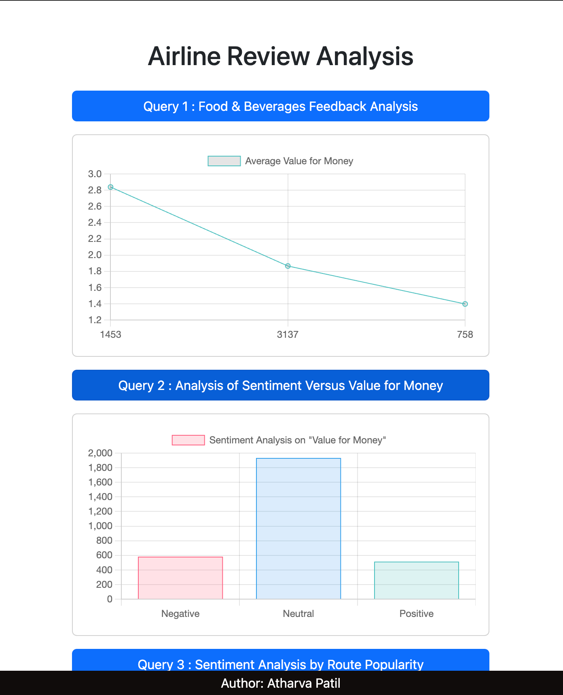
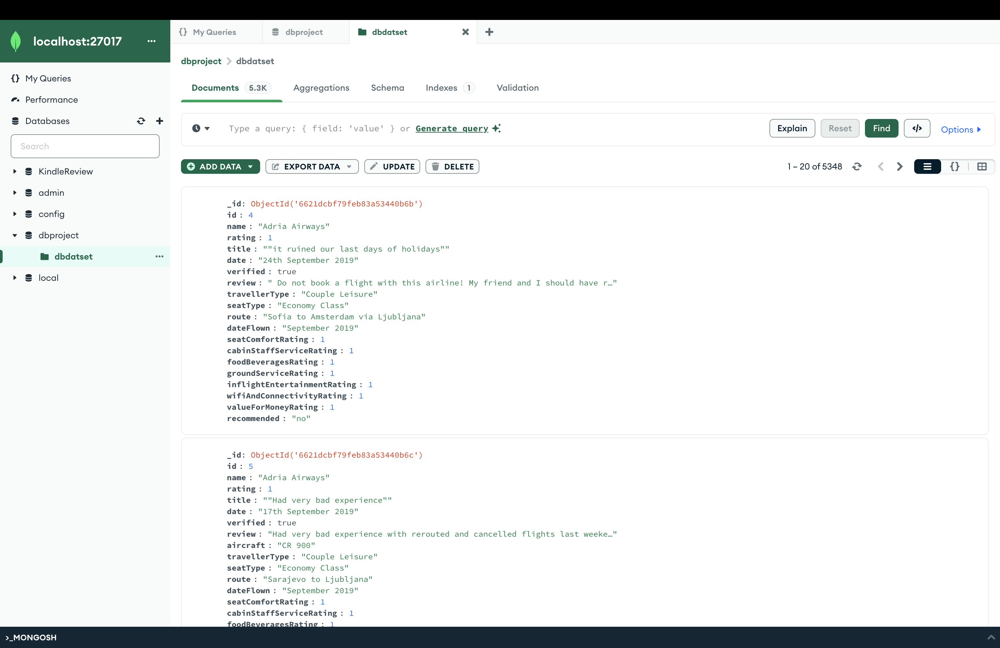
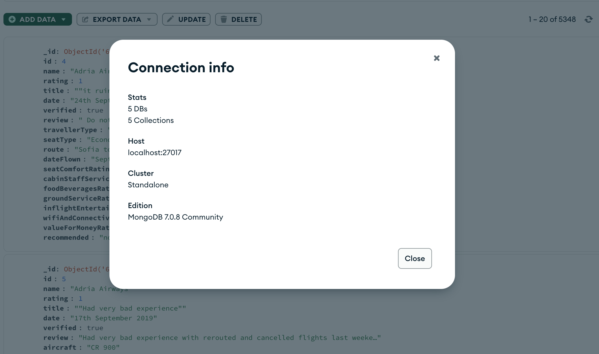
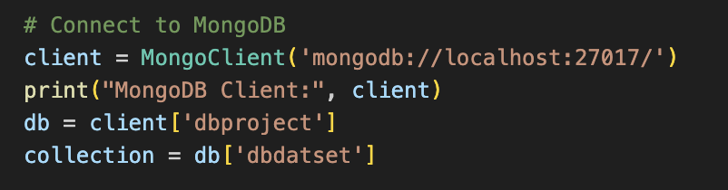

# Airline Reviews Analysis Project

## Overview
This repository hosts the Airline Reviews Analysis Project for CS532 - Database Systems. This project utilizes the Airline Reviews dataset from Kaggle to perform a series of insightful NoSQL queries using MongoDB and Flask without traditional data science or machine learning libraries.


### Dataset
The dataset is available on Kaggle and can be accessed through this [link](https://www.kaggle.com/datasets/juhibhojani/airline-reviews). It comprises over 5,000 samples with detailed attributes related to airline service reviews.

## Prerequisites
- **MongoDB**: A NoSQL database used for storing the dataset.
- **Python**: Programming language used for the Flask application.
- **Flask**: A micro web framework written in Python for building the web application.
- **Flask-CORS**: A Flask extension for handling Cross-Origin Resource Sharing (CORS), making cross-origin AJAX possible.
- **PyMongo**: MongoDB driver for Python, used to interact with the MongoDB from Python.

## Installation and Setup

### Installing MongoDB on macOS
1. **Install MongoDB with Homebrew**:
   ```bash
   brew tap mongodb/brew
   brew install mongodb-community@7.0
   ```

2. **Start MongoDB as a Background Service**:
   ```bash
   brew services start mongodb/brew/mongodb-community
   ```

   Or run MongoDB manually in a terminal session:
   ```bash
   mongod --config /usr/local/etc/mongod.conf
   ```

3. **Stop MongoDB as a Background Service**:
   ```bash
   brew services stop mongodb/brew/mongodb-community
   ```

### Setting Up MongoDB
1. **Create database as "dbproject" and collection as "dbdatset" and upload dataset csv file in dbdatset** 
   

2. **Check Connection Info**:
   

3. **In connect.py give database and collection info**:
   

### Setting Up Python and Flask
1. **Create a Virtual Environment** (navigate to your project directory first):
   ```bash
   python3 -m venv venv
   source venv/bin/activate
   ```

2. **Install Flask and Flask-CORS**:
   ```bash
   pip install Flask Flask-CORS
   ```

3. **Install PyMongo**:
   ```bash
   pip install pymongo
   ```

### Run the Flask Application
Navigate to your project directory where `connect.py` is located and start the Flask server:
```bash
python connect.py
```
This command runs your Flask application and makes it accessible via `http://localhost:5000/`.

Also you can run the frontend and backend while running live server on index.html


## Queries Implemented

This section describes the specific MongoDB queries implemented in the Flask application. Each query is designed to extract valuable insights from the dataset without the use of traditional data science tools or libraries.

### Query 1: Food & Beverages Feedback Analysis
- **Goal**: Analyze sentiments from food and beverage reviews.
- **Details**: This query groups reviews by sentiment, calculates the average 'value for money' rating per group, counts the number of reviews in each group, and sorts the results by average rating. It aims to provide insight into how sentiments about food and beverages correlate with customer perceptions of value for money.

### Query 2: Analysis of Sentiment Versus Value for Money
- **Goal**: Investigate the relationship between review sentiment and 'valueForMoneyRating'.
- **Details**: This query determines the correlation between sentiment expressed in the reviews and the value for money rating given by customers. It explores whether higher satisfaction with the airline's services correlates with better perceptions of value across different price points.

### Query 3: Sentiment by Route Popularity
- **Goal**: Categorize routes by popularity based on the number of reviews.
- **Details**: This query analyzes sentiments to determine if more popular routes receive better or worse reviews. It categorizes routes by the number of reviews they receive and assesses sentiments to identify potential areas for operational improvement.

## Usage
- Access the application through your web browser at `http://localhost:5000/` to interact with the API endpoints.
- The endpoints for the analysis tasks are structured as follows:
  - `/task1` - Food & Beverages Feedback Analysis
  - `/task2` - Analysis of Sentiment Versus Value for Money
  - `/task3` - Sentiment by Route Popularity

## Contributing
Contributions to this project are welcome. Please fork the repository and submit a pull request with your suggested changes.

## License
This project is distributed under the MIT License. See the LICENSE file in the repository for more information.


